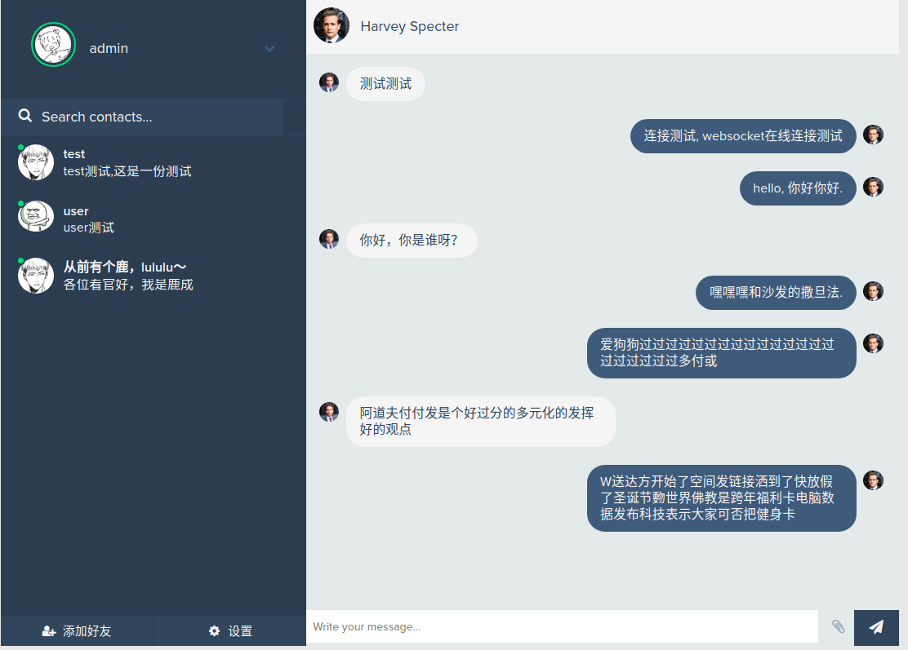

websocket IM  

微服务-即时聊天/设计  

- 特点  
1.内部rpc  
2.对外rest json  
3.[deercoder-gin](https://github.com/dreamlu/deercoder-gin)  
4.websocket即时通讯  
5.[在线接口查看](https://www.eolinker.com/#/share/index?shareCode=jH4ISr)  
6....  

> 状态-ing  

- 微服务各个模块运行状态  
[http://localhost:8500](http://localhost:8500)

- 登录  
  

- 好友列表(will like this)
  
