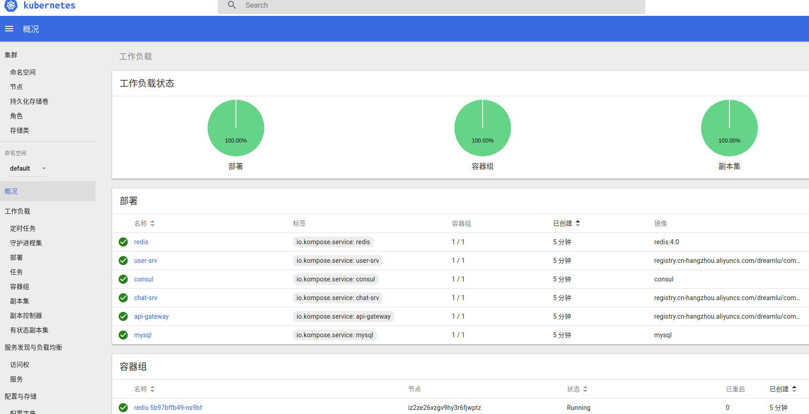

k8s 使用  

- 步骤  
1.[k8s安装步骤](https://zhuanlan.zhihu.com/p/46341911)  
2.[k8s面板安装](https://www.jianshu.com/p/7ad86c485f49)  
3.执行上级目录  
n.....

- k8s文件  
1.通过kompose结合docker-compose生成对应yaml文件  
2.源yaml文件, 可通过命令`./kompose convert -f ../docker-compose.yaml`生成  
2.修改相关yaml文件,此处为修改后的yaml  
n...  

- 运行  
1.进入k8s目录   
2.`kubectl create -f .`  
3.如有加载顺序问题,先运行mysql相关yaml,其余顺序皆可  
  

  